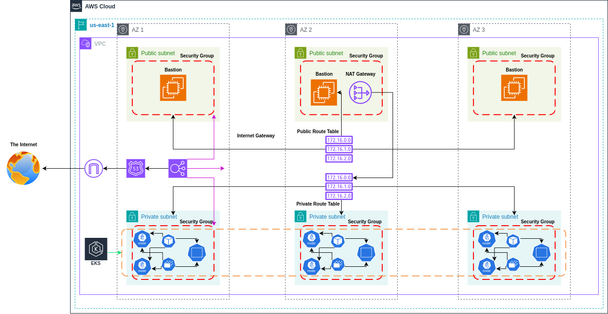

# 🌐 CLOUDOPS-PIPELINE

**Official Repository for the Full GitOps Pipeline on AWS using Terraform, EKS, Jenkins, ArgoCD, and Secrets Management**

---



## ✨ Contributors

This project would not have been possible without the valuable contributions of these collaborators:

<div align="center">

<table>
  <tr>
    <td align="center">
      <a href="https://github.com/hosseldin">
        <br />
        <sub><b>Hossam Mahmoud</b></sub>
      </a>
    </td>
    <td align="center">
      <a href="https://github.com/mina-safwat-1">
        <br />
        <sub><b>Mina Safwat</b></sub>
      </a>
    </td>
    <td align="center">
      <a href="https://github.com/M-Samii">
        <br />
        <sub><b>Mahmoud Samy</b></sub>
      </a>
    </td>
    <td align="center">
      <a href="https://github.com/Mohamed0Mourad">
        <br />
        <sub><b>Mohammed Mourad</b></sub>
      </a>
    </td>
  </tr>
</table>

</div>


<br>

## 📋 Table of Contents

- [🔧 Prerequisites](#-prerequisites)
- [☁️ EKS Cluster Setup](#%ef%b8%8f-eks-cluster-setup)
- [🔗 Connect `kubectl` to EKS Cluster](#-connect-kubectl-to-eks-cluster)
- [🎠 Install AWS Load Balancer Controller](#-install-aws-load-balancer-controller)
- [⚙️ Install EBS CSI Driver](#%ef%b8%8f-install-ebs-csi-driver)
- [⚙️ Install Jenkins (via Helm)](#%ef%b8%8f-install-jenkins-via-helm)
- [🔑 Jenkins ECR Integration](#-jenkins-ecr-integration)
- [🚀 Jenkins Pipeline (Kaniko to ECR)](#-jenkins-pipeline-kaniko-to-ecr)
- [🛥️ Install ArgoCD](#-install-argocd)
- [⚙️ ArgoCD App Deployment Example](#%ef%b8%8f-argocd-app-deployment-example)
- [🔄 ArgoCD Image Updater Setup](#-argocd-image-updater-setup)
- [🔑 Git Credentials for ArgoCD](#-git-credentials-for-argocd)

---

## 🔧 Prerequisites

- AWS CLI configured with appropriate permissions
- `kubectl` installed and configured
- `eksctl` installed
- `helm` installed
- Terraform installed and configured

---

## ☁️ EKS Cluster Setup

Provision your EKS cluster using Terraform. Ensure that the cluster is up and running before proceeding.

---

## 🔗 Connect `kubectl` to EKS Cluster

```bash
aws eks update-kubeconfig --name eks-cluster --region us-east-1
```

---

## 🎠 Install AWS Load Balancer Controller

1. **Download IAM Policy:**

   ```bash
   curl -O https://raw.githubusercontent.com/kubernetes-sigs/aws-load-balancer-controller/v2.12.0/docs/install/iam_policy.json
   ```

2. **Create IAM Policy:**

   ```bash
   aws iam create-policy \
       --policy-name AWSLoadBalancerControllerIAMPolicy \
       --policy-document file://iam_policy.json
   ```

3. **Associate IAM OIDC Provider:**

   ```bash
   eksctl utils associate-iam-oidc-provider --region=us-east-1 --cluster=eks-cluster --approve
   ```

4. **Create IAM Service Account:**

   ```bash
   eksctl create iamserviceaccount \
       --cluster=eks-cluster \
       --namespace=kube-system \
       --name=aws-load-balancer-controller \
       --attach-policy-arn=arn:aws:iam::<ACCOUNT_ID>:policy/AWSLoadBalancerControllerIAMPolicy \
       --override-existing-serviceaccounts \
       --region us-east-1 \
       --approve
   ```

   > **Note:** Replace `<ACCOUNT_ID>` with your AWS account ID.

5. **Install via Helm:**

   ```bash
   helm repo add eks https://aws.github.io/eks-charts
   helm repo update
   helm install aws-load-balancer-controller eks/aws-load-balancer-controller \
     -n kube-system \
     --set clusterName=eks-cluster \
     --set serviceAccount.create=false \
     --set serviceAccount.name=aws-load-balancer-controller
   ```

6. **Verify Installation:**

   ```bash
   kubectl get deployment -n kube-system aws-load-balancer-controller
   ```

---

## ⚙️ Install EBS CSI Driver

```bash
eksctl create iamserviceaccount \
    --name ebs-csi-controller-sa \
    --namespace kube-system \
    --cluster eks-cluster \
    --role-name AmazonEKS_EBS_CSI_DriverRole \
    --attach-policy-arn arn:aws:iam::aws:policy/service-role/AmazonEBSCSIDriverPolicy \
    --region us-east-1 \
    --approve
```

---

## ⚙️ Install Jenkins (via Helm)

1. **Add Helm Repo & Create Namespace:**

   ```bash
   helm repo add jenkinsci https://charts.jenkins.io
   helm repo update
   kubectl create namespace jenkins-ns
   ```

2. **Prepare Values File:**

   ```bash
   helm show values jenkinsci/jenkins > /tmp/jenkins.yml
   ```

3. **Edit `/tmp/jenkins.yml` to set `serviceType: LoadBalancer` and configure ingress.**

4. **Install Jenkins:**

   ```bash
   helm install jenkins jenkinsci/jenkins --values /tmp/jenkins.yml -n jenkins-ns
   ```

5. **Get Jenkins Password:**

   ```bash
   kubectl exec --namespace jenkins-ns -it svc/jenkins -c jenkins -- /bin/cat /run/secrets/additional/chart-admin-password
   ```

6. **Get LoadBalancer IP:**

   ```bash
   kubectl get svc --namespace jenkins-ns jenkins
   ```

---

## 🔑 Jenkins ECR Integration

1. **Create IAM Policy & User:**

2. **Create ECR Repository:**

3. **Create Kubernetes Secret:**

---

## 🚀 Jenkins Pipeline (Kaniko to ECR)

Set up your Jenkins pipeline using the `Jenkinsfile` provided in the repository.

---

## 🛥️ Install ArgoCD

```bash
kubectl create namespace argocd
helm repo add argo https://argoproj.github.io/argo-helm
helm repo update
helm install argocd argo/argo-cd --namespace argocd
kubectl patch svc argocd-server -n argocd -p '{"spec": {"type": "LoadBalancer"}}'
kubectl get svc -n argocd argocd-server
```

---

## ⚙️ ArgoCD App Deployment Example

```yaml
apiVersion: argoproj.io/v1alpha1
kind: Application
metadata:
  name: argotest-app
  namespace: argocd
spec:
  project: default
  source:
    repoURL: https://github.com/M-Samii/Argo-repo.git
    targetRevision: HEAD
    path: k8s
  destination:
    server: https://kubernetes.default.svc
    namespace: argoapp
  syncPolicy:
    automated:
      prune: true
      selfHeal: true
    syncOptions:
      - CreateNamespace=true
```

---

## 🔄 ArgoCD Image Updater Setup

1. **Create Namespace & Secret:**

2. **Install Image Updater:**

3. **Check Logs:**

---

## 🔑 Git Credentials for ArgoCD

```bash
kubectl -n argocd create secret generic git-creds \
  --from-file=sshPrivateKey=/home/ec2-user/.ssh/id_rsa
```


